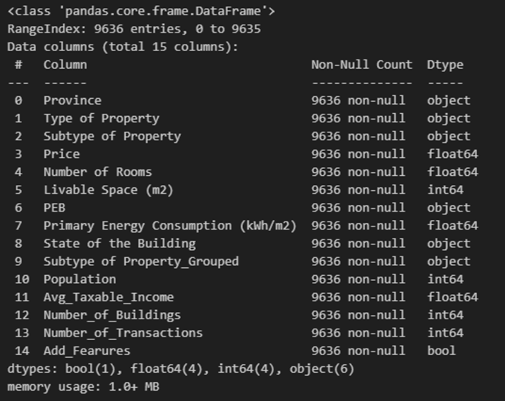
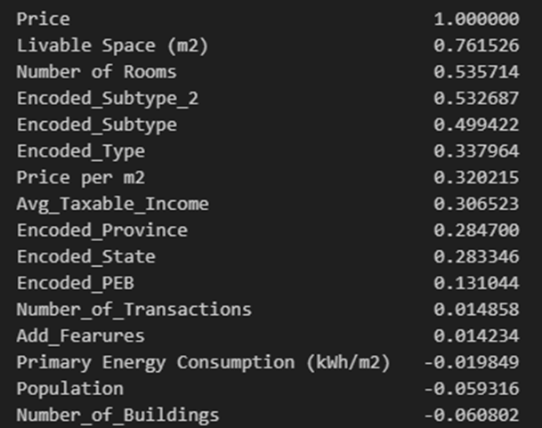
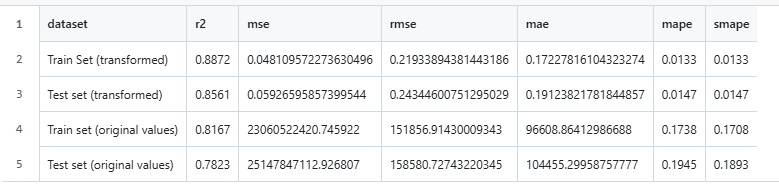
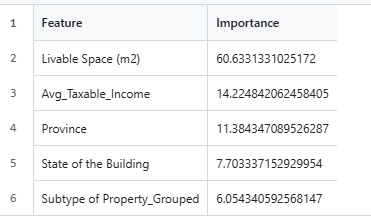
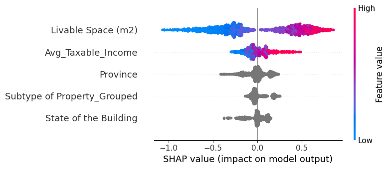

# Brief presentation of the model

---

## Input Data for the Model

The model used data that was previously collected from the website [Immoweb](https://www.immoweb.be/en).

---

## Data Preparation

At the data preparation stage, the following steps were performed:

- Handle missing values.
- Drop duplicates.
- Convert categorical features to numerical.
- Remove outliers.
- Drop irrelevant columns.

Additionally:
- The **Province** column was added using a function based on zip (postal) code values.
- A new column, **Subtype_Property_Grouped**, was created to group property subtypes into four categories:
  - **Houses:** house, town-house, bungalow, farmhouse, country-cottage.
  - **Apartments:** apartment, duplex, penthouse, ground-floor, flat-studio, triplex, service-flat, kot.
  - **Luxury Properties:** villa, chalet, mansion, exceptional-property, castle, manor-house.
  - **Specialized Properties:** apartment-block, mixed-use-building, loft, other-property.

Outliers in the **price** and **living area** columns, which had very high skewed values, were removed using the interquartile range (IQR) method.

### Additional Features
Characteristics from open sources ([Statbel](https://statbel.fgov.be/en/open-data), [OpenDataSoft](https://data.opendatasoft.com/)) were added:
- **Population**
- **Avg_Taxable_Income**
- **Number_of_Buildings**
- **Number_of_Transactions**

These socioeconomic indicators relate to the municipality where the property is located.

A new column, **Add_Features**, was created from boolean columns ("Fully Equipped Kitchen," "Furnished," "Open Fire," "Terrace," "Garden," "Swimming Pool") to indicate if any additional features were present.

The final dataset included **9,636 objects** characterized by **15 features**.

---

## Determining the Impact of Indicators Using Correlation

The correlation coefficient between each feature and the **price** was calculated. Categorical features were converted to numerical values by determining the average price for each category. Features with an absolute correlation coefficient above **0.3** were retained, while highly correlated features were excluded.

### Selected Indicators
The model used these 5 features:
1. **Livable Space (m²)**
2. **Avg_Taxable_Income**
3. **Province**
4. **State of the Building**
5. **Subtype of Property_Grouped**

---

## Model Description

The model leveraged **CatBoostRegressor**, a tree-based regression algorithm optimized for structured data with numerical and categorical features.

### Key Characteristics of CatBoost:
- **Tree-Based Architecture:**
- **Gradient Boosting** (sequential learning, reducing residual errors).
- **Scale Invariance** (not sensitive to feature scaling).
- **Native Categorical Feature Handling:** Eliminates the need for manual encoding.

The target variable, **Price**, was logarithmized to reduce the influence of extreme values, stabilize the model, and approximate a normal distribution. No standardization was needed as tree-based models are invariant to scaling.

### Training Configuration
- **Categorical variables:** 'Province,' 'State of the Building,' 'Subtype of Property_Grouped.'
- **Train-test split ratio:** 80-20%.
- **Training parameters:** 
  - Iterations = 1000
  - Learning rate = 0.05
  - Depth = 6

---

## Model Evaluation

After training the model and testing it on a test set with transformed and original data, the main metrics of model quality and accuracy were calculated.

### Performance on Transformed Data:
- **Train Set:**
  - **R² = 0.8872**: Explains 88.72% of the variance.
  - **RMSE = 0.219339**, **MAE = 0.172278**, **MAPE = 1.33%**: Indicates precise and reliable predictions.
- **Test Set:**
  - **R² = 0.8561**: Slightly lower but robust accuracy.
  - **RMSE = 0.243446**, **MAE = 0.191238**, **MAPE = 1.47%**: Good generalization to unseen data.

### Performance on Original Data:
- **Train Set:**
  - **R² = 0.8167**: Lower accuracy on absolute values.
  - **RMSE = 151,856.91**, **MAE = 96,608.86**, **MAPE = 17.38%**: Highlights challenges in capturing variance.
- **Test Set:**
  - **R² = 0.7823**: Further reduced on test data.
  - **RMSE = 158,580.73**, **MAE = 104,455.30**, **MAPE = 19.45%**: Predicts less accurately on the original scale.

---

## Factor Evaluation

Using **Feature Importance** and **SHAP Analysis**, the most significant contributors to price were:
1. **Livable Space (m²)**: Largest influence.
2. **Avg_Taxable_Income**: Moderate influence.
The smallest influence is the property type group.

Higher values of **living space size** and **average income** increased property prices, while lower values had the opposite effect.

---

## Conclusion

- **Better Performance on Log-Transformed Data:** The log transformation reduces the effect of extreme values, allowing the model to perform more accurately. Evaluating Metrics are consistently better in this space.
- **Challenges on the Original Scale:** The model struggles to handle the wide range and skewed distribution of the original data. High RMSE and MAE indicate difficulty predicting very large prices.
- **Generalization Gap:** Slightly lower performance on test data compared to training data suggests some level of overfitting. This might be mitigated by regularization or enhanced cross-validation.

### Execution Time
The training code execution took approximately **50 seconds**.
